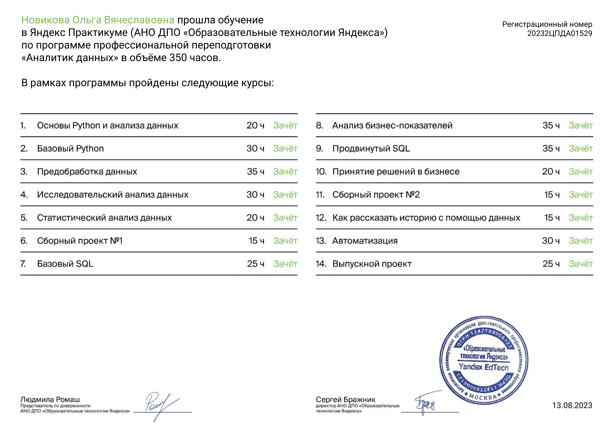

# Data Analyst
Описание:
В репозитории представлены проекты курса (https://practicum.yandex.ru/data-analyst/) (Яндекс.Практикум).

Основные инструменты и навыки, полученные при обучении:

Языки: Python, SQL
Анализ данных: библиотеки Pandas, NumPy, SciPy
Визуализация: Matplotlib, Plotly, Seaborn
Построение дашбордов: Tableau
Метрики юнит-экономики, когортный анализ
А/В-тестирование
Работа с гипотезами

Программа обучения: 

# Portfolio

Проекты

| №   | Наименование проекта                | Описание                                                     | Навыки и инструменты                                                         |
| ---- | ------------------------------------------------------------ | ------------------------------------------------------------ | ------------------------------------------------------------ |
| 1.   | [Исследование сервиса "Яндекс.Музыка".Музыка больших городов.](https://github.com/wolganovikova/Portfolio/tree/master/Yandex%20Music) | Анализ сервиса “Яндекс.Музыка” — сравнение пользователей по городам(Москва, Санкт-Петергбург) и по дням неделям(понедельник, среда, пятница).| python, pandas|
| 2.   | [Исследование надежности заемщиков.](https://github.com/wolganovikova/Portfolio/tree/master/Investigation%20of%20the%20reliability%20of%20borrowers) | Анализ влияния количество детей, семейного положения, уровнем дохода и цели кредита клиента на факт погашения кредита в срок.  | предобработка, python, pandas, seaborn, matplotlib|
| 3.   | [Исследование объявлений о продаже квартир "Яндекс Недвижимость".](https://github.com/wolganovikova/Portfolio/tree/master/Research%20of%20ads%20for%20the%20sale%20of%20apartments%20Yandex%20Real%20Estate)) | Анализ рыночной стоимости объектов недвижимости сервиса Яндекс Недвижимость — архив объявлений о продаже квартир в Санкт-Петербурге и соседних населённых пунктах за несколько лет. | предобработка, исследовательский анализ, визуализация, python, pandas, numpy, matplotlib, seaborn|
| 4.   | [Анализ тарифов компании «Мегалайн».Определение перспективного тарифа для телеком компании.](https://github.com/wolganovikova/Portfolio/tree/master/Analysis%20of%20the%20company's%20tariffs) | Анализ двух тарифов: «Смарт» и «Ультра» в компании «Мегалайн» за 2018 год. , чтобы скорректировать рекламный бюджет.| python, pandas, numPy, seaborn, matplotlib, sciPy, проверка статистических гипотез|
| 5.   | [Сборный проект 1.Анализ рынка компьютерных игр для интернет-магазина «Стримчик».](https://github.com/wolganovikova/Portfolio/tree/master/Team%20Project-1%20Computer%20Games) | Анализ рынка компьютерных игр, выявить определяющие успешность игры закономерности, определить портрет пользователя для каждого из регионов, проверить рабочие гипотезы(сравнить средние пользовательские рейтинги платформ Xbox One, PC и  жанров Action,Sports). | python, pandas, numPy, seaborn, matplotlib, sciPy, предобработка, исследовательский анализ, проверка статистических гипотез|
| 6.   | [Базовый SQL.Анализ рынка инвестиций  о венчурных фондах и инвестициях в компании-стартапы.](https://github.com/wolganovikova/Portfolio/tree/master/Basic%20%20SQL) |Анализ рынка инвестиций проводился с помощью запросов разной сложности к базе данных, которая хранит информацию о венчурных фондах и инвестициях в компании-стартапы.  | SQL, PostgreSQL|
| 7.   | [Маркетинговый анализ приложения Procrastinate Pro+.](https://github.com/wolganovikova/Portfolio/tree/master/Marketing%20analysis%20of%20the%20application%20Procrastinate%20Pro%2B) | Анализ бизнес-показателей развлекательного приложения Procrastinate Pro+. Несмотря на огромные вложения в рекламу, последние несколько месяцев компания терпит убытки. Ваша задача — разобраться в причинах и помочь компании выйти в плюс. | python, pandas, numPy, seaborn, matplotlib, sciPy, когортный анализ, юнит-экономика, продуктовые метрики|
| 8.   | [Продвинутый SQL. Анализ сервиса постов базы данных StackOverflow.](https://github.com/wolganovikova/Portfolio/tree/master/Advanced%20%20%20SQL) | Анализ проводился с базой данных StackOverflow — сервиса вопросов и ответов о программировании. В данной версии базы хранятся данные о постах за 2008 год, но в таблицах есть информация и о более поздних оценках, которые эти посты получили. | SQL, PostgreSQL|
| 9.   | [Анализ крупного интернет магазина. А_В-тест.Принятие решений в бизнесе. ](https://github.com/wolganovikova/Portfolio/tree/master/Decision%20making%20in%20business) | Анализ A/B-тестов и приоритизация гипотез для увеличения выручки интернет-магазина. | python, pandas, numPy, seaborn, matplotlib, sciPy, A/B-тестирование, проверка статистических гипотез|  
| 10.   | [Сборный проект 2. Анализ поведения пользователей мобильного приложения.](https://github.com/wolganovikova/Portfolio/tree/master/Mobile%20App%20Research) | Анализируем поведение покупателей на основании логов пользователей и результатов А/А/В - эксперимента (изменение шрифта во всем приложении). | python, pandas, numPy, seaborn, matplotlib, sciPy, plotly, A/B-тестирование, проверка статистических гипотез, визуализация данных, событийная аналитика, продуктовые метрики| 
| 11.   | [Рынок заведений общественного питания Москвы.](https://github.com/wolganovikova/Portfolio/tree/master/Public%20catering%20market%20research) | Анализ рынка заведений общественного питания Москвы для инвестра из фонда «Shut Up and Take My Money», который хочет открыть заведение в Москве.| python, pandas, numPy, seaborn, matplotlib, sciPy, plotly, re, визуализация данных| 
| 12.   | [Дашборд для Яндекс.Дзена и Презентация](https://github.com/wolganovikova/Portfolio/tree/master/Dashboard%20for%20Yandex.Zen%20and%20Presentation%20Tableau) | Анализ пользовательского взаимодействия с карточками статей сервиса Яндекс.Дзен.Строим дашборд  с помощью Tableau Public и делаем презентацию.| python, pandas, PostgreSQL, Tableau, sqlalchemy, продуктовые метрики, построение дашбордов| 
| 13.   | [Выпускной проект:](https://github.com/wolganovikova/Portfolio/tree/master/Graduation%20project)[Мобильное приложение,](https://github.com/wolganovikova/Portfolio/tree/master/Graduation%20project/Mobile%20App%20Unnecessary%20things) [A/B тест,](https://github.com/wolganovikova/Portfolio/tree/master/Graduation%20project/%D0%90%D0%92%20%D1%82%D0%B5%D1%81%D1%82%D1%8B) [SQL](https://github.com/wolganovikova/Portfolio/tree/master/Graduation%20project/SQL)| I.Анализ пользовательского взаимодействия с карточками статей сервиса Яндекс.Дзен.Строим дашборд  с помощью Tableau Public и делаем презентацию. II. Анализ результатов A/B-теста после введения улучшенной программы рекомендаций для региона EU.; III. SQL-Анализ базы данных, которая содержит информацию о книгах, издательствах, авторах, а также пользовательские обзоры книг.| python, pandas, numpy, seaborn, matplotlib, plotly, scipy,SQL, PostgreSQL, Tableau, sqlalchemy, продуктовые метрики, когортный анализ, построение дашбордов| 

